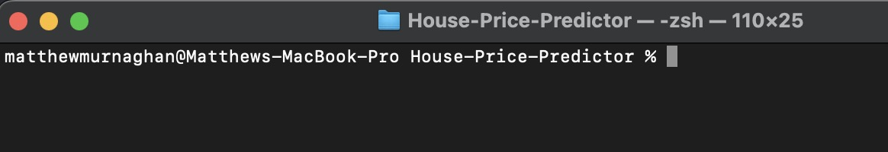
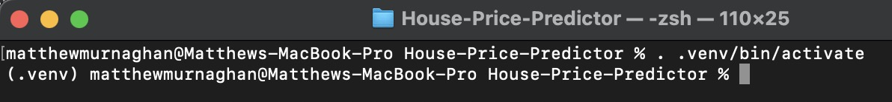

# **House-Price-Predictor**
The aim of this repo is to demonstrate Machine Learning and Deep Learning concepts with respect to predicting the price of houses for sale given a dataset supplied by kaggle.com

## **Table of Contents**

1. [Introduction](#introduction)
    * [Business Case](#business-case)
    * [Data set](#data-set)
    * [Business Requirements](#business-case)
    * [User Stories - Data Practitioner](#user-stories-data-practitioner)
    * [User Stories - Client](#user-stories-client)
2. [Project Set Up](#project-set-up)
    * [About pyenv](#about-pyenv)
    * [Setting up the Virtual Environment (venv)](#setting-up-the-virtual-environment-venv)
    * [Installing packages and dependencies](#installing-packages-and-dependencies)
3. [Usage](#usage)
    * [Running the application](#running-the-application)
    * [Inputting features for prediction](#inputting-features-for-prediction)
4. [Data preprocessing](#data-preprocessing)
    * [Cleaning the data](#cleaning-the-data)
    * [Feature engineering](#feature-engineering)
5. [Exploratory data analysis](#exploratory-data-analysis)
    * [Visualizations of features and correlations](#visualizations-of-features-and-correlations)
6. [Model development](#model-development)
    * [Model selection](#model-selection)
    * [Hyperparameter tuning](#hyperparameter-tuning)
    * [Model evaluation](#model-evaluation)
7. [Results](#results)
    * [Predicted sale prices for the four inherited properties](#predicted-sale-prices-for-the-four-inherited-properties)
    * [Prediction for other houses in Ames, Iowa](#prediction-for-other-houses-in-ames-iowa)
8. [Conclusion](#conclusion)
    * [Summary of findings](#summary-of-findings)
    * [Future work](#future-work)
9. [References](#references)
    * [Data source](#data-source)
    * [Libraries and resources used](#libraries-and-resources-used)
10. [Acknowledgements](#acknowledgements)
    * [Credits to contributors or other sources of support](#credits-to-contributors-or-other-sources-of-support)

## **Introduction**<a name="introduction"></a>
This is the final project that I am undertaking as part of the Code Institute Full Stack Developer program. This project deals with the topics of Machine Learning, Deep Learning, Python development, business case analysis, API integration and dashboard development using Streamlit.

### **Business Case - Predicting House Prices in Ames, Iowa**<a name="business-case"></a>
This project aims to assist a fictional client, Lydia Doe, in maximizing the sales price for four houses that she inherited in Ames, Iowa. Lydia is concerned about inaccurate pricing estimation due to her limited knowledge of the Iowan housing market. Therefore, she seeks the assistance of a data practitioner to predict the sales price of the inherited properties and any other house in Ames, Iowa.

To achieve this goal, we will build a Data Web App that predicts the sales price from the four inherited houses based on their attributes. Additionally, we will develop a dashboard that allows Lydia to explore how the house attributes correlate with the sale price using data visualizations.

### **Dataset**<a name="data-set"></a>
We will use a public dataset of house prices for Ames, Iowa, sourced from Kaggle. The dataset consists of 1,460 observations and 81 explanatory variables that describe (almost) every aspect of residential homes in Ames, Iowa. 

The dataset contains information on the house's features, such as the number of bedrooms, bathrooms, and square footage, as well as information on the lot, such as the size and shape of the lot, and other important details like the age of the house, condition, and location. 

This dataset will enable us to build a model that predicts the sale price of a house in Ames, Iowa, based on its attributes. The dataset is provided by [Kaggle.com](https://www.kaggle.com/datasets/codeinstitute/housing-prices-data).


### **Business Requirements**<a name="business-requirements"></a>
The business requirements are outlined below:
* Predict the sale price of Lydia's four inherited properties, as well as any other house in Ames, Iowa.
* Develop a dashboard that allows Lydia to explore how the house attributes correlate with the sale price using data visualizations.
* Provide an explanation of the key factors that influence the sale price of a house in Ames, Iowa.
* With the successful completion of this project, Lydia will be able to accurately price her properties and make informed decisions regarding any future real estate investments in Ames, Iowa.


### **User Stories - Data Practitioner**<a name="user-stories-data-practitioner"></a>
From the projecct requirements, we can create a list of user stories for both the data practioner and the standard non-technical user.

1. As a data practitioner, I want to import the public dataset provided by Lydia into our system so that I can build a model to predict the sales price of the four houses located in Ames, Iowa, USA.

2. As a data practitioner, I want to clean and preprocess the dataset so that I can build an accurate model for predicting house prices.

3. As a data practitioner, I want to explore the dataset to understand the features and their relationships with the sale price so that I can create informative visualizations for the client.

4. As a data practitioner, I want to build a predictive model that accurately predicts the sale price of the four inherited properties as well as any other house in Ames, Iowa.

5. As a data practitioner, I want to optimize the model's hyperparameters to ensure that it is as accurate as possible.

6. As a data practitioner, I want to test the model's accuracy and ensure that it is reliable for predicting house prices.

### **User Stories - Client**<a name="user-stories-client"></a>

1. As a client, I want to see visualizations of the correlated variables against the sale price so that I can better understand the relationship between the features and the price.

2. As a client, I want to be able to input the features of a house and get an accurate prediction of the sale price so that I can make informed decisions about buying or selling properties in Ames, Iowa.

3. As a client, I want to be able to see the predicted sale price of each of the four inherited properties so that I can make informed decisions about selling them.

4. As a client, I want the data web app to be user-friendly and easy to use so that I can quickly and easily access the information I need to make informed decisions.

I tracked the user stories for this project on GitHub using individual tickets in adherance with Agile project management fundamentals.

## **Project Set Up**<a name="project-set-up"></a>

I approached this project a bit differently than the other projects I've undertaken as part of the Full Stack Developer course with the Code Institute. 

Due to a recent issue with the GitPod platform that I used to develop my previous projects, I took it upon myself to configure my projects locally. I'm working on a Macbook Pro with an M1 Pro chip, so I have more than enough processing power to run the Machine Learning and Deep Learning processing.

To configure the project locally, I checked the supported Python versions by Heroku. As some of the libraries used in this project are not supported on the latest version of Python, 3.11.2 currently, I will be deploying the project on Python 3.10.10, which is available on all stacks on Heroku.

In order to maintain the project environment, I used the pyenv version management project to create a virtual environment on my local machine to run the project in. This ensures that the project will remain stable when it is reproduced by other developers in the future.

## **About Pyenv**<a name="about-pyenv"></a>

Pyenv is a tool for managing multiple versions of Python on a single machine. It allows you to easily switch between different versions of Python, and provides a way to manage Python dependencies for different projects.

### **Why Use Pyenv?**

Using Pyenv has several benefits:

- **Compatibility:** Different projects may require different Python versions. Pyenv allows you to switch between versions of Python without affecting other projects running on the same machine.

- **Dependency Management:** Pyenv provides a way to manage Python dependencies for different projects. With Pyenv, you can create isolated virtual environments for each project and install the required dependencies in these environments.

- **Flexibility:** Pyenv is a flexible tool that can be customized to fit your workflow. You can specify a default Python version to use across all projects, set per-project Python versions, and specify Python versions on a per-shell basis.

### **Installation**

To install Pyenv, follow the instructions in the [official documentation](https://github.com/pyenv/pyenv#installation). Once installed, you can start using Pyenv to manage your Python environment.

### **Getting Started**

To get started with Pyenv, check out the [official documentation](https://github.com/pyenv/pyenv#usage). This will guide you through the process of creating virtual environments, switching between Python versions, and managing dependencies for different projects.

## **Setting up the Virtual Environment (venv)**<a name="setting-up-the-virtual-environment-venv"></a>
You can check for available Python versions that you can install with pyenv by using the following command:
```
pyenv install --list

OR

pyenv install -l
```

I installed the necessary Python version required for the project using this command in the terminal:
```
pyenv install 3.10.10
```

After cloning the repository, I used the command below to set the local python environment for the directory that housed the project:
```
pyenv local 3.10.10
```

This creates a .python-version file in the current directory. Please note, you must first navigate to the project directory in the terminal before running this command. You can do this by typing this command in the terminal:
```
cd /path/to/your/project/your_project_name
```

You can check that this has worked by checking for hidden files in the directory.
Run this command:
```
ls -a
```

You can check the version is correct with this command:
```
cat .python-version
```

Once the local version of python was set, I used the following Python command to create the virtual environment:
```
python -m venv .venv
```

This creates a virtual environment in the directory, containing all of the binaries necessary to run Python. It also has it's own pip, which allows you t keep all of the packages and dependencies needed for the package stored locally in the venv, instead of on your global system. *Clean!*

The common naming convention is to use .venv, but you can use any name you like.

I included the .venv file and the .python-version file in my .gitignore file, so you will need to configure this yourself when you are replicating the project. It is good practice to do this, as virtual environments should be configured wherever they are being deployed for program stability.

After creating your environment, you should activate it by running this command from the root directory of the project:
```
. .venv/bin/activate
```

The images below show how the terminal looks before and after you have successfully activated your virtual environment.

|  |
| :--: |
| *Terminal before venv has been activated* |

<br>

|  |
| :--: |
| *Terminal after venv has been activated* |

<br>

You can check to make sure that the correct version of python is being detected in the environment by running the following command:
```
python -V
```

It should output the following message to the terminal if you have done everything right:
```
Python 3.10.10
```

To deactivate the environment, simply type the following command from anywhere int the terminal:
```
deactivate
```

This should bring you back into the global terminal.

Now the the virtual environment in set up, we can start intalling the dependencies needed for this project.

## **Installing packages and dependencies**<a name="installing-packages-and-dependencies"></a>
to install the packages and required dependencie for this project, run the following command from the root directory:

```
pip install requiremets.txt
```

Because I am running on Mac OS using the ARM64 architecure from the M1 Pro processor, there are some slight changes I had to make when installing the packages.

I ran the following command to ensure that only the binaries using x86 architecture were installed, as not all of the python packages used in this project have been released with compatible versions for my architecture.

```
env ARCHFLAGS="-arch x86_64" pip install -r requirements.txt
```

This ensured that the project was stable and ran locally on my machine. I also replaced tensorlfow with tensorflow-macos in the requirements.txt file as per apples direction in this article: [Using TensorFlow on MacOS](https://developer.apple.com/forums/thread/686926)

Once the required packages have been installed, you can see the full list by running the following command:
```
pip list
```

After installing the package on my system, I executed the following command to ensure that the project's package versions are compatible with its stable version. This ensures that anyone replicating the project will also use compatible package versions.
```
pip freeze > requirements.txt
```

Now that the environment is configured, we can begin to explore the data set and  the relating business case for this project.

## **Acknowledgements**<a name-="acknowledgements"></a>

This section lists all of the different sources and individuals that added to the overall project.

### **Credits to contributors or other sources of support**<a name="credits-to-contributors-or-other-sources-of-support"></a>

1. [Stack overflow - Convert df.info() to standalone dataframe](https://stackoverflow.com/questions/64067424/how-to-convert-df-info-into-data-frame-df-info)

2. 

### **Tools and Libaries**<a name="tools-and-libraries"></a>

1. [pyenv](https://github.com/pyenv/pyenv)
    * Used to create the virtual environment in which the project was run to ensure stability and isolation of installed packages.   