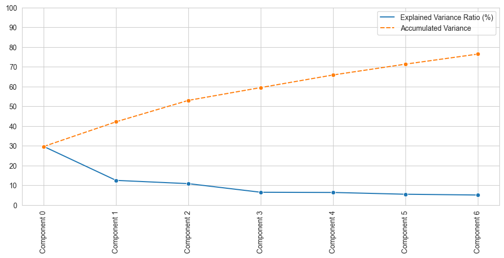
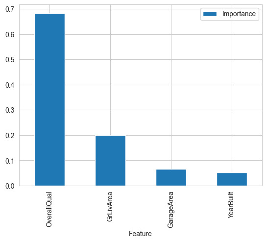

# **House-Price-Predictor**
The aim of this repo is to demonstrate Machine Learning and Deep Learning concepts with respect to predicting the price of houses for sale given a dataset supplied by kaggle.com

## **Table of Contents**

1. [Introduction](#introduction)
    * [Business Case](#business-case)
    * [Data set](#data-set)
    * [Business Requirements](#business-requirements)
    * [Hypothesis and Test](#hypothesis-and-test)
    * [User Stories - Data Practitioner](#user-stories-data-practitioner)
    * [User Stories - Client](#user-stories-client)
2. [Project Set Up](#project-set-up)
    * [About pyenv](#about-pyenv)
    * [Setting up the Virtual Environment (venv)](#setting-up-the-virtual-environment-venv)
    * [Installing packages and dependencies](#installing-packages-and-dependencies)
3. [Dashboard](#dashboard)
    * [Running the application](#running-the-application)
    * [Summary](#summary)
    * [House Sale Price Study](#price-study)
    * [Price Predictor](#price-predictor)
    * [ML: House Sale Price Prediction](#ml-price-prediction)
4. [Data preprocessing](#data-preprocessing)
    * [Data cleaning](#data-cleaning)
    * [Feature engineering](#feature-engineering)
5. [Model development](#model-development)
    * [Model selection](#model-selection)
    * [Hyperparameter tuning](#hyperparameter-tuning)
    * [Model evaluation](#model-evaluation)
    * [Model evaluation - PCA](#model-evaluation-pca)
    * [Model selection](#model-selection)
6. [Results](#results)
7. [Conclusion](#conclusion)
    * [Summary of findings](#summary-of-findings)
    * [Future work](#future-work)
8. [Deployment](#deployment) 
9. [References](#references)
    * [Data source](#data-source)
    * [Libraries and resources used](#libraries-and-resources-used)
10. [Acknowledgements](#acknowledgements)
    * [Credits to contributors or other sources of support](#credits-to-contributors-or-other-sources-of-support)

## **Introduction**<a name="introduction"></a>
This is the final project that I am undertaking as part of the Code Institute Full Stack Developer program. This project deals with the topics of Machine Learning, Deep Learning, Python development, business case analysis, API integration and dashboard development using Streamlit.

Link to the project dashboard is [here](https://house-price-predictor.herokuapp.com)!

### **Business Case - Predicting House Prices in Ames, Iowa**<a name="business-case"></a>
This project aims to assist a fictional client, Lydia Doe, in maximizing the sales price for four houses that she inherited in Ames, Iowa. Lydia is concerned about inaccurate pricing estimation due to her limited knowledge of the Iowan housing market. Therefore, she seeks the assistance of a data practitioner to predict the sales price of the inherited properties and any other house in Ames, Iowa.

To achieve this goal, we will build a Data Web App that predicts the sales price from the four inherited houses based on their attributes. Additionally, we will develop a dashboard that allows Lydia to explore how the house attributes correlate with the sale price using data visualizations.

### **Dataset**<a name="data-set"></a>
We will use a public dataset of house prices for Ames, Iowa, sourced from Kaggle. The dataset consists of 1,460 observations and 24 variables that describe (almost) every aspect of residential homes in Ames, Iowa. 

The dataset contains information on the house's features, such as the number of bedrooms, bathrooms, and square footage, as well as information on the lot, such as the size and shape of the lot, and other important details like the age of the house, condition, and location. 

This dataset will enable us to build a model that predicts the sale price of a house in Ames, Iowa, based on its attributes. The dataset is provided by [Kaggle.com](https://www.kaggle.com/datasets/codeinstitute/housing-prices-data).

**Dataset Description Table**
---
|Variable|Meaning|Units|
|:----|:----|:----|
|1stFlrSF|First Floor square feet|(Min - Max > Sq. ft.) 334 - 4692|
|2ndFlrSF|Second floor square feet|(Min - Max > Sq. ft.) 0 - 2065|
|BedroomAbvGr|Bedrooms above grade (does NOT include basement bedrooms)|(Min - Max > Bedrooms) 0 - 8|
|BsmtExposure|Refers to walkout or garden level walls|Gd:Good Exposure; Av: Average Exposure; Mn: Mimimum Exposure;No: No Exposure; None: No Basement|
|BsmtFinType1|Rating of basement finished area|GLQ: Good Living Quarters; ALQ: Average Living Quarters; BLQ: Below Average Living Quarters; Rec: Average Rec Room; LwQ: Low Quality; Unf: Unfinshed; None: No Basement|
|BsmtFinSF1|Type 1 finished square feet|(Min - Max > Sq. ft.) 0 - 5644|
|BsmtUnfSF|Unfinished square feet of basement area|(Min - Max > Sq. ft.) 0 - 2336|
|TotalBsmtSF|Total square feet of basement area|(Min - Max > Sq. ft.) 0 - 6110|
|GarageArea|Size of garage in square feet|(Min - Max > Sq. ft.) 0 - 1418|
|GarageFinish|Interior finish of the garage|Fin: Finished; RFn: Rough Finished; Unf: Unfinished; None: No Garage|
|GarageYrBlt|Year garage was built|(Min - Max > Year) 1900 - 2010|
|GrLivArea|Above grade (ground) living area square feet| (Min - Max > Sq. ft.) 334 - 5642|
|KitchenQual|Kitchen quality|Ex: Excellent; Gd: Good; TA: Typical/Average; Fa: Fair; Po: Poor|
|LotArea| Lot size in square feet|(Min - Max > Sq. ft.) 1300 - 215245|
|LotFrontage| Linear feet of street connected to property|(Min - Max > Lin. ft.) 21 - 313|
|MasVnrArea|Masonry veneer area in square feet|(Min - Max > Sq. ft.) 0 - 1600|
|EnclosedPorch|Enclosed porch area in square feet|(Min - Max > Sq. ft.) 0 - 286|
|OpenPorchSF|Open porch area in square feet|(Min - Max > Sq. ft.) 0 - 547|
|OverallCond|Rates the overall condition of the house|10: Very Excellent; 9: Excellent; 8: Very Good; 7: Good; 6: Above Average; 5: Average; 4: Below Average; 3: Fair; 2: Poor; 1: Very Poor|
|OverallQual|Rates the overall material and finish of the house|10: Very Excellent; 9: Excellent; 8: Very Good; 7: Good; 6: Above Average; 5: Average; 4: Below Average; 3: Fair; 2: Poor; 1: Very Poor|
|WoodDeckSF|Wood deck area in square feet|(Min - Max > Sq. ft.) 0 - 736|
|YearBuilt|Original construction date|(Min - Max > Year) 1872 - 2010|
|YearRemodAdd|Remodel date (same as construction date if no remodeling or additions)|(Min - Max > Year) 1950 - 2010|
|SalePrice|Sale Price|(Min - Max > Price in $) 34900 - 755000|
---


### **Business Requirements**<a name="business-requirements"></a>
The business requirements are outlined below:
* Perform a correlation and/or PPS study to investigate the most relevant variables correlated to the sale price.
* Deliver an ML system that can predict the summed sale price of Lydia's four inherited properties, as well as any other house in Ames, Iowa.
* Deliver either a conventional ML or Neural network based system.
* Develop a dashboard that allows Lydia to explore how the house attributes correlated with the sale price using data visualizations.
* Consider changing from regression to classification if suitable/required.
* Perform an extensive hyperparameter search for a given algorithm.

### **Hypothesis and Test**<a name="hypothesis-and-test"></a>
The following are the hypotheses that I have made for this project:
1.  I suspect that a house with high OverallQual sells for a higher price.
    
    A correlation analysis between OverallQual and SalePrice can show this relationship.
2.  I suspect that a house with a big garage sells for a higher price.
    
    A correlation analysis between GarageArea and SalePrice can show this relationship.


### **User Stories - Data Practitioner**<a name="user-stories-data-practitioner"></a>
From the projecct requirements, we can create a list of user stories for both the data practioner and the standard non-technical user.

1. As a data practitioner, I want to import the public dataset provided by Lydia into our system so that I can build a model to predict the sales price of the four houses located in Ames, Iowa, USA.

2. As a data practitioner, I want to clean and preprocess the dataset so that I can build an accurate model for predicting house prices.

3. As a data practitioner, I want to explore the dataset to understand the features and their relationships with the sale price so that I can create informative visualizations for the client.

4. As a data practitioner, I want to build a predictive model that accurately predicts the sale price of the four inherited properties as well as any other house in Ames, Iowa.

5. As a data practitioner, I want to optimize the model's hyperparameters to ensure that it is as accurate as possible.

6. As a data practitioner, I want to test the model's accuracy and ensure that it is reliable for predicting house prices.

### **User Stories - Client**<a name="user-stories-client"></a>

1. As a client, I want to see visualizations of the correlated variables against the sale price so that I can better understand the relationship between the features and the price.

2. As a client, I want to be able to input the features of a house and get an accurate prediction of the sale price so that I can make informed decisions about buying or selling properties in Ames, Iowa.

3. As a client, I want to be able to see the predicted sale price of each of the four inherited properties so that I can make informed decisions about selling them.

4. As a client, I want the data web app to be user-friendly and easy to use so that I can quickly and easily access the information I need to make informed decisions.

I tracked the user stories for this project on GitHub using individual tickets in adherance with Agile project management fundamentals.

## **Project Set Up**<a name="project-set-up"></a>

I approached this project a bit differently than the other projects I've undertaken as part of the Full Stack Developer course with the Code Institute. 

Due to a recent issue with the GitPod platform that I used to develop my previous projects, I took it upon myself to configure my projects locally. I'm working on a Macbook Pro with an M1 Pro chip, so I have more than enough processing power to run the Machine Learning and Deep Learning processing.

To configure the project locally, I checked the supported Python versions by Heroku. As some of the libraries used in this project are not supported on the latest version of Python, 3.11.2 currently, I will be deploying the project on Python 3.10.10, which is available on all stacks on Heroku.

In order to maintain the project environment, I used the pyenv version management project to create a virtual environment on my local machine to run the project in. This ensures that the project will remain stable when it is reproduced by other developers in the future.

## **About Pyenv**<a name="about-pyenv"></a>

Pyenv is a tool for managing multiple versions of Python on a single machine. It allows you to easily switch between different versions of Python, and provides a way to manage Python dependencies for different projects.

### **Why Use Pyenv?**

Using Pyenv has several benefits:

- **Compatibility:** Different projects may require different Python versions. Pyenv allows you to switch between versions of Python without affecting other projects running on the same machine.

- **Dependency Management:** Pyenv provides a way to manage Python dependencies for different projects. With Pyenv, you can create isolated virtual environments for each project and install the required dependencies in these environments.

- **Flexibility:** Pyenv is a flexible tool that can be customized to fit your workflow. You can specify a default Python version to use across all projects, set per-project Python versions, and specify Python versions on a per-shell basis.

### **Installation**

To install Pyenv, follow the instructions in the [official documentation](https://github.com/pyenv/pyenv#installation). Once installed, you can start using Pyenv to manage your Python environment.

### **Getting Started**

To get started with Pyenv, check out the [official documentation](https://github.com/pyenv/pyenv#usage). This will guide you through the process of creating virtual environments, switching between Python versions, and managing dependencies for different projects.

## **Setting up the Virtual Environment (venv)**<a name="setting-up-the-virtual-environment-venv"></a>
You can check for available Python versions that you can install with pyenv by using the following command:
```
pyenv install --list

OR

pyenv install -l
```

I installed the necessary Python version required for the project using this command in the terminal:
```
pyenv install 3.10.10
```

After cloning the repository, I used the command below to set the local python environment for the directory that housed the project:
```
pyenv local 3.10.10
```

This creates a .python-version file in the current directory. Please note, you must first navigate to the project directory in the terminal before running this command. You can do this by typing this command in the terminal:
```
cd /path/to/your/project/your_project_name
```

You can check that this has worked by checking for hidden files in the directory.
Run this command:
```
ls -a
```

You can check the version is correct with this command:
```
cat .python-version
```

Once the local version of python was set, I used the following Python command to create the virtual environment:
```
python -m venv .venv
```

This creates a virtual environment in the directory, containing all of the binaries necessary to run Python. It also has it's own pip, which allows you t keep all of the packages and dependencies needed for the package stored locally in the venv, instead of on your global system. *Clean!*

The common naming convention is to use .venv, but you can use any name you like.

I included the .venv file and the .python-version file in my .gitignore file, so you will need to configure this yourself when you are replicating the project. It is good practice to do this, as virtual environments should be configured wherever they are being deployed for program stability.

After creating your environment, you should activate it by running this command from the root directory of the project:
```
. .venv/bin/activate
```

The images below show how the terminal looks before and after you have successfully activated your virtual environment.

|  |
| :--: |
| *Terminal before venv has been activated* |

<br>

|  |
| :--: |
| *Terminal after venv has been activated* |

<br>

You can check to make sure that the correct version of python is being detected in the environment by running the following command:
```
python -V
```

It should output the following message to the terminal if you have done everything right:
```
Python 3.10.10
```

To deactivate the environment, simply type the following command from anywhere int the terminal:
```
deactivate
```

This should bring you back into the global terminal.

Now the the virtual environment in set up, we can start intalling the dependencies needed for this project.

## **Installing packages and dependencies**<a name="installing-packages-and-dependencies"></a>
to install the packages and required dependencie for this project, run the following command from the root directory:

```
pip install requiremets.txt
```

Because I am running on Mac OS using the ARM64 architecure from the M1 Pro processor, there are some slight changes I had to make when installing the packages.

I ran the following command to ensure that only the binaries using x86 architecture were installed, as not all of the python packages used in this project have been released with compatible versions for my architecture.

```
env ARCHFLAGS="-arch x86_64" pip install -r requirements.txt
```

This ensured that the project was stable and ran locally on my machine. I also replaced tensorlfow with tensorflow-macos in the requirements.txt file as per apples direction in this article: [Using TensorFlow on MacOS](https://developer.apple.com/forums/thread/686926)

**Update**

I removed tensorflow from the project as deploying the macos version to heroku caused issues.

Once the required packages have been installed, you can see the full list by running the following command:
```
pip list
```

After installing the package on my system, I executed the following command to ensure that the project's package versions are compatible with its stable version. This ensures that anyone replicating the project will also use compatible package versions.
```
pip freeze > requirements.txt
```

Now that the environment is configured, we can begin to explore usage of the delivered application.

## **Dashboard**<a name="dashboard"></a>
This section deals with using the streamlit dashboard app that would be delivered to the client.
### **Running the application**<a name="running-the-application"></a>
The app itself is provided to the client through a streamlit dashboard delpoyed through heroku, please see the delpoyment section for more info.

If looking to run the app locally, one can clone the project, install the required dependencies and python environment, then run the following command in their terminal:

    streamlit run <your_app_name>

This will run a local version of the app on your machine.

### **Summary**<a name="summary"></a>
This page in the dashboard gives a biref overview of the project objective, the supplied dataset, the business requirements specified by the client and a table explaining the different features of the dataset.

It provides links to both kaggle.com and the readme file and is non interactive.


### **House Sale Price Study**<a name="price-study"></a>
This section deals with the study conducted on the dataset to address the business requirement, stating that a pearson/spearman correlation test and a pps score test should be performed on the dataset to determine the variables with the highest correlation to sale price.

It generates scatter plots of the most correlated variables, pearson and spearman correlation heatmaps, pps heatmaps and displays the head of the dataset.

This section is somewhat interactive, allowing the user to show content using a tickbox system.

### **Price Predictor**<a name="price-predictor"></a>
This section deals with making new predictions based on the created ML model and also calculates the summed sale price of the four properties inherited by the client.

This addresses the business requirements exactly and is interactive, spitting out realtime predictions based on user entry.

### **Hypothesis and Validation**<a name="hypothesis-and-validation"></a>
This section addresses the hypotheses made at the beginning of the project and how they are verified. It references the results of the correlation study as reason for failure to reject the given hypotheses that the overall quality and garage size have a strong positive correlation with the sale price of the house.

### **ML: House Sale Price Prediction**<a name="ml-price-prediction"></a>
This is a technical section addressing the construction of the ML pipeline used in the dashboard to predict house sale price. It also outlines which of the features are the most important when predicting the sale price, and calculates the relative error that the model experiences on both the train and test datasets. It also generates two graphs showing the error between the predictions made by the model vs the real sale price.

## **Data Preprocessing**<a name="data-preprocessing"></a>
This section focuses heavily on the CRISP-DM process, read more about it [here](https://www.datascience-pm.com/crisp-dm-2/). Essentially, we spend the largest ammount of our time on the project here, ensureing that the data is properly prepared for the ML model. Datasets are useless unless they are properly prepared and screened before being use for analysis. a concept to keep in mind is "Garbage in, garbage out".

### **Data cleaning**<a name="data-cleaning"></a>
Data cleaning is carried out in a jupyter notebook, 3. DataCleaning.ipynb. Here the, we prefromed and exploratory data analysis (EDA) on the dataset using pandasprofiling to visualise the distribution of each feature, check for outliers and missing data.

This allowed us to make informed decisions about which parts of the data was worth keeping, and which were worth scrapping.

The notebook goes through the data cleaning process in detail and the reasons for dropping certain pieces of data, or the applied imputation methods and the reasoning for them to replace missing data for each feature in a way that does not overall impact the distribution and characteristics of each feature.

### **Feature engineering**<a name="feature-engineering"></a>
This section addresses the feature engineering done to the cleaned dataset. It is described in detail in jupyter notebook 4, FeatureEngineering.
We apply a series of transformers to the data in an attepmt to bring each distribution closer to that of a normal distribution. 

We use some custom functions taken from the codeinstitute course to visualise the resulting distribution plot, QQ plot and candlestick/IQR plot to see which if any transformers have a positive effect on the data, resulting in less outliers and a more evenly distributed dataset.

At the end, we selected a combination of the yeojohnson, power and log transforms and applied them to their respective best features.

We then performed a smart correlation selection on the entire dataset. This allowed us to analyse which of the features in the dataset were overcorrelated with each other, essentially, doubling the data without adding much extra value. We added this step into creating the first pipeline, allowing us to trim down the required features for us to feed into the ML pipeline during the modeling phase. 

An ordinal encoder was also employed to change the categorical variables contained within the set to numerical values as the scikit learn and feature engine libararies require numerical values to analyse the dataset.
## **Model development**<a name="model-development"></a>
This section is explained in more detail in notebook 5, Modeling and Evaluation. 

The goal of this section is to decide which algorithm is best to use for our ML model, and which set of hyperparameters yields the best results for said algorithm.
### **Model selection**<a name="model-selection"></a>

Here, we ran a series of tests on the dataset, using custom functions taken from the codeinstitute course. These tests allowed us to see from a selection of different algorithms, which was the most successful in achieving the highest regression based R2 score.

During this phase, when testing for the best algorithm, only the default hypterparameters were used.

It is stated in the business requirements that an R2 score above 0.75 is required in order to satisfy the clients needs.

Using the smart feature selection method, we chose to use an Extra Trees Classifier algorithm. Read more about it [here](https://towardsdatascience.com/what-when-how-extratrees-classifier-c939f905851c).
### **Hyperparameter tuning**<a name="hyperparameter-tuning"></a>
Once the best algorithm had been found we then ran another set of tests using a custom function where we passed a series of of known hyperparamters configurations to tune the model for best results.

The best parameters for the extra trees classifier were found to be:

    {'model__max_depth': 6, 'model__n_estimators': 20}

### **Model evaluation**<a name="model-evaluation"></a>
This pipeline with tuned hyper parameters returned an R2 score of 0.861 on the train set and 0.836 on the test set.

### **Model evaluation - PCA**<a name="model-evaluation-pca"></a>
A second model evaluation was completed using a PCA (Principal Component Analysis). Essentially, we filter down the dataset to only include a selected amount of features that consitute our chosen threshold of 75% of the variance in the data.

|  |
| :--: |
| *PCA shows 7 components dictate 76.4% of the data variance* |

After swapping to the PCA model, the new best classifer was found to be the random forrest algorithm with best parameters below:

    {'model__max_depth': None, 'model__n_estimators': 700}

Using this method and the 7 most variant features causes an overfit in the model, yielding an R2 score of 0.975 on the train set and 0.768 on the test set, subsetting the best features down to the top four, OverallQual, GarageArea, GrLivArea and YearBuilt, the PCA model yields an R2 score of 0.894 and 0.811 on the train and test sets, meeting the business requirements and reducing the overfitting.

The feature importance plot is shown below:

|  |
| :--: |
| *PCA shows 7 components dictate 76.4% of the data variance* |

After refining the PCA model, the best algorithm was still the random forrest classifer, but the new best parameters were as below:

    {'model__max_depth': 6, 'model__n_estimators': 100}

### **Model selection**<a name="model-selection"></a>
I chose to use the refined PCA pipline in my final production as it seemlingly yielded acceptable results whilst utilising minimal data, there are also arguements to be made for the Smart Feature Selection pipeline as well, as the train and test sets are closer in their approximate error.

## **Results**<a name="results"></a>
After choosing a final pipeline, I fitted the inherrited house records to it and yeilded the following results:

|House|OverallQual|GarageArea|GrLivArea|YearBuilt|Sale Price|
|:----|:----|:----|:----|:----|:----|
|1|4|730|896|1961|$125730.39|
|2|5|312|1329|1958| $137871.20|
|3|4|482|1629|1997|$163085.71|
|4|5|470|1604|1998|$164317.24|
|||||Total Sum|$591004.54|

We now have a pipeline that can accurately predict the sale price of houses in Ames, Iowa and have predicted an accurate sum of sale price for the 4 inherrited houses belonging to the client.

## **Conclusions**<a name-="conclusions"></a>
This section addresses the conclusions of our project.

### **Summary of Findings**<a name-="summary-of-findings"></a>
To conclude our project, we must check that we have satisfied all business requirements:

|Business Requirement|Satisfied?|
|:---|:---|
|Perform a correlation and/or PPS study to investigate the most relevant variables correlated to the sale price.| :white_check_mark: |
|Deliver an ML system that can predict the summed sale price of Lydia's four inherited properties, as well as any other house in Ames, Iowa.| :white_check_mark: |
|Deliver either a conventional ML or Neural network based system.| :white_check_mark: |
|Develop a dashboard that allows Lydia to explore how the house attributes correlated with the sale price using data visualizations.| :white_check_mark: |
|Consider changing from regression to classification if suitable/required.| :white_check_mark: |
|Perform an extensive hyperparameter search for a given algorithm.| :white_check_mark: |

* We have satisfied all business requirements
* We can predict the prices of other houses in Ames Iowa
* We can predict the sum of selling all four inherrited houses: $591004.54

### **Future Work**<a name-="future-work"></a>
Due to time contraints and technical difficulties with deployment, I was unable to deploy a tensorflow version of the project and compare the results and performance tradeoffs. 

Developing on a Mac requires me to use the tensorflow-macos python libarary, which is not supported on the heroku stack. More research is needed here to find a way to work localy with tensorflow on Mac, and delpoy in a linux friendly environment.

## **Deployment**<a name-="deployment"></a>
* This project was deployed on Heroku, Stack 22, using python version 3.10.10.
* If you want to deploy it yourself, follow these steps:
    1. Sign up to Heroku [here](https://signup.heroku.com)
    2. Create a new app from the heroku dashboard.
    3. Select your nearest region, either US or EU.
    4. Fork this project into your own repo.
    5. Connect your new heroku app to your forked repo.
    6. If you make any changes to the python version or dashboard tool, update the Procfile, runtime.txt and setup.sh files to refelct your new environment.
    7. Build your app from the dashboard and voila!.

Please note that all of this can be done from the command line by installing the [Heroku CLI](https://devcenter.heroku.com/articles/heroku-cli).

## **Acknowledgements**<a name-="acknowledgements"></a>

This section lists all of the different sources and individuals that added to the overall project.

### **Credits to contributors or other sources of support**<a name="credits-to-contributors-or-other-sources-of-support"></a>

1. [Stack overflow - Convert df.info() to standalone dataframe](https://stackoverflow.com/questions/64067424/how-to-convert-df-info-into-data-frame-df-info)

2. The Code Institute Data Analytics Course.

3. My mentor Marcel.

### **Tools and Relevant Libaries**<a name="tools-and-libraries"></a>

1. [pyenv](https://github.com/pyenv/pyenv)
    * Used to manage the multiple versions of python installed on my local machine and set the required python version for the virtual environment.
2. [venv](https://docs.python.org/3/library/venv.html)
    * Used to create the virtual environment in which the project was run to ensure stability and isolation of installed packages.
3. [Heroku](https://dashboard.heroku.com/apps)
    * Used to hose the project dashboard.
4. [scikit learn](https://scikit-learn.org/stable/)
    * Used to implement core ML functions.
5. [Feature Engine](https://feature-engine.trainindata.com/en/latest/index.html)
    * Used for core feature engineering and selection functions.
